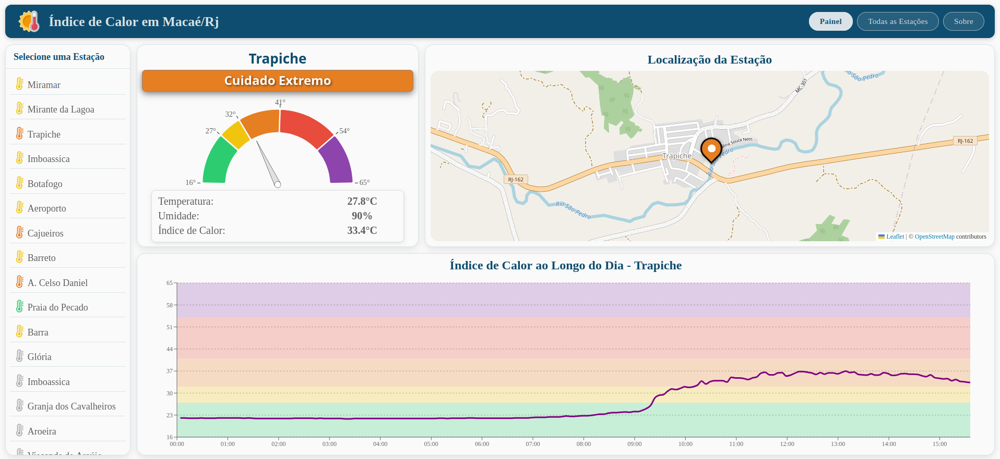

# SIMIC-Macaé

Dashboard para monitoramento em tempo real do **Índice de Calor** nas estações meteorológicas de Macaé/RJ, desenvolvido como produto de pesquisa acadêmica na UENF.

🌐 **[simicmacae.vercel.app](https://simicmacae.vercel.app/)**



## Sobre o Projeto

O **SIMIC-Macaé** consome dados de estações meteorológicas pessoais (PWS) instaladas em bairros de Macaé via **The Weather Company API** e calcula o Índice de Calor pela equação de regressão múltipla da NOAA. O objetivo é traduzir dados meteorológicos em categorias de risco acessíveis à população.

## Funcionalidades

- Leitura instantânea de temperatura, umidade, vento e **Índice de Calor** por estação
- Histórico de 24 horas em gráfico interativo
- Mapa com localização das estações e marcador colorido por nível de risco
- Listagem comparativa de todas as estações ativas
- Atualização automática a cada 5 minutos com cache local

## Tecnologias

`React 19` · `Vite` · `Leaflet` · `Recharts` · `react-gauge-component` · `The Weather Company API`

## Executar localmente

```bash
npm install
npm run dev
```

> É necessário configurar a chave da API em `src/services/apiConfig.js`.

---

Desenvolvido na **Universidade Estadual do Norte Fluminense Darcy Ribeiro (UENF)** — Macaé, RJ
